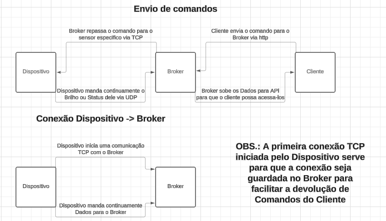

# Internet das Coisas - IOT

# Introdução

No projeto de Concorrência e Conectividade, criamos uma solução em Python. Nela, dispositivos IoT se comunicam com um broker central, que por sua vez facilita a interação com uma interface de controle. Focamos em eficiência e escalabilidade, permitindo múltiplas conexões simultâneas e assegurando uma comunicação fluida e confiável entre dispositivos e a interface do usuário. Essa abordagem não apenas reforça a conectividade na infraestrutura IoT, mas também estabelece uma base sólida para futuras expansões e inovações no campo da Internet das Coisas.

# Broker

.....
# Dispositivo
- ***Gerenciamento do dispositivo:***
  
.....
# Cliente

.....
# Tecnologias utilizadas

- ***Ferramantas:*** Para o desenvolvimento desta aplicação, utilizamos ferramentas como Insomnia e Visual Studio Code.

- ***Outras:*** Para a produção do código fonte, utilizamos a linguagem de programação Python, além de algumas bibliotecas dessa linguagem, tais como requests, Flask, etc.
  
# Arquitetura da solução
Sobre a arquitetura utilizada para a troca de mensagens podemos citar a conexão "Dispositivo <-> Broker" e "Broker <-> Cliente". Além disso, utilizamos três componentes, sendo eles: dispositivo, broker e cliente. Note que ambos os componentes possuem uma seção contendo mais detalhes.
  
- ***Dispositivo -> Broker:*** A comunicação entre os dispositivos e o broker para o envio de dados foi feita através de sockets, via protocolo TCP/IP. Neste caso, utilizamos o protocolo UDP, pois ao enviarmos dados, a velocidade de envio foi uma prioridade.

    `Observação:` Note que a conexão TCP é inicializada pelo dispositivo, permitindo que o broker envie requisições para os dispositivos conectados sem a necessidade de abrir múltiplas conexões pelo broker, o que demandaria a busca por diversos endereços físicos. No entanto, ele não envia dados utilizando TCP.
  
- ***Broker -> Dispositivo:*** A comunicação entre o broker e os dispositivos para o envio de comandos/requisições foi feita, assim como a comunicação do dispositivo com o broker, usando sockets, via protocolo TCP/IP. Porém, ao contrário da comunicação de dados, utilizamos o TCP, a fim de priorizar a segurança do envio de requisições.
   
- ***Broker <-> Cliente:*** A comunicação entre o broker e o cliente foi realizada por meio de rotas de uma API REST, utilizando verbos como: GET, POST, PUT E DELETE.

     `Definição:` Uma API REST (Representational State Transfer) é uma arquitetura de comunicação que utiliza os princípios do protocolo HTTP para permitir a comunicação entre sistemas distribuídos.

Ademais, ainda precisamos falar sobre a ordem que essas comunicações acontecem, para isso observe a   <em>Figura 1.</em>  

 

   
   
     <em>Figura 1. Camada de Transporte.</em>  
   
   

Analisando a imagem, mais especificamente na parte "Envio de comandos", fica evidente que todas as informações passam pelo broker, independentemente de serem dados ou comandos. Por exemplo, se desejo enviar uma mensagem remotamente do cliente para um dispositivo, devo adicionar o comando à minha API através de uma rota. Em seguida, o broker utilizará o protocolo TCP/IP para enviar o comando ao dispositivo via TCP. Já na parte "Conexão Dispositivo -> Broker", é nos mostrado que o dispositivo inicia a comunicação TCP, a fim de que o broker identifique e armazene as conexões.
   
# Protocolo de comunicação entre dispositivo e Broker

- ***Camada de Aplicação:***

- ***Camada de Transporte:***

   - **Dispositivo:** Sobre o protocolo que o dispositivo utiliza para se comunicar com o broker, devemos abordar que 
   - **Broker:**

# Interface da Aplicação (REST)

.....
# Formatacao, envio e tratamento de dados

.....
# Tratamento de conexões simultâneas

.....
# Desempenho

.....
# Confiabilidade da solução

.....
# Como Executar

## Etapas:

### 1. Configuração do Ambiente:
   - **Requisitos do Sistema:** Será preciso ter ao menos o Docker instalado na máquina para que seja possível criar a imagem e executá-la.

### 2. Obtenção do Código Fonte:
   - **Clonagem do Repositório:** Você pode utilizar o seguinte comando no terminal para adquirir a aplicação: https://github.com/Emanuel-Antonio/PBL-Redes.git.
   - **Download do Código Fonte:** Caso não tenha o Git na máquina, você pode fazer o download desse repositório manualmente. Vá até o canto superior, selecione "Code" e depois "Download ZIP", e então extraia o arquivo ZIP na sua máquina.

### 3. Configuração da Aplicação:
   - **Arquivos de Configuração:** Abra as pastas "Cliente" e "Dispositivo" e altere nos arquivos "cliente.py" e "dispositivo.py" o endereço IP para o endereço da máquina onde o broker esteja rodando.

### 4. Execução da Aplicação:
   - **Sem Docker:**
     1. Basta ir nos arquivos "broker.py", "dispositivo.py" e "cliente.py", dentro das pastas "Broker", "Dispositivo" e "Cliente", respectivamente, e executá-los um por um no seu editor de texto ou terminal. Observe que para isso será necessário que você tenha o Python na máquina e que possua as bibliotecas requests e Flask dessa linguagem.
        
   - **Com Docker:**
     1. Execute o seguinte comando no terminal dentro das pastas Cliente, Dispositivo e Broker: "docker build -t nome_do_arquivo .", para gerar as imagens, repita três vezes.
     2. Agora execute as imagens usando o comando "docker run --network='host' -it nome_da_imagem" para executar as três imagens criadas, vale ressaltar que esse processo deve ser feito três vezes já que são três imagens distintas.

# Conclusão

.....

